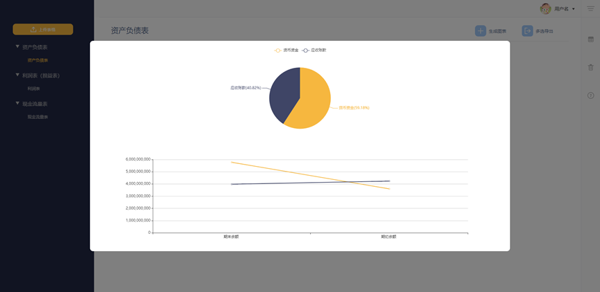

# 财视猫
  

## 项目介绍
本项目采用Vue+Sheet.JS+Echarts实现了`前端解析`财务报表Excel文件，根据模糊检索思想`自动提取财务报表时间字段`，并获取数据集，用户点击图表类型可直接生成图表  
  
  
## 使用
### dist文件夹
打包完毕，直接点击index

### npm
npm init安装  
npm run serve启动本地服务器  
npm run build 打包代码  

## 目录结构
├─dist //打包完成代码  
│  ├─css  
│  ├─fonts  
│  ├─img  
│  └─js  
├─public  
└─src  
    ├─assets  //img,CSS等静态资源  
    │  ├─components  
    │  │  ├─ChartContainerCom  
    │  │  ├─RightSideBarCom  
    │  │  ├─SideBarCom  
    │  │  └─UpBarCom  
    │  ├─pages  
    │  │  └─LoginPage  
    │  └─plugin  
    ├─components  //组件  
    └─views  //页面  

